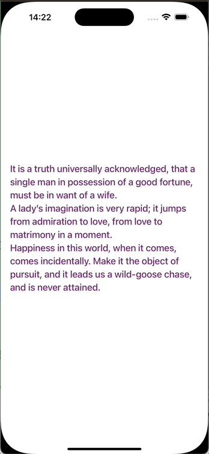

<div align="center" >
  
</div>

# UIFadeLabel

[](https://travis-ci.org/Sfh03031/UIFadeLabel)
[](https://cocoapods.org/pods/UIFadeLabel)
[](https://cocoapods.org/pods/UIFadeLabel)
[](https://cocoapods.org/pods/UIFadeLabel)

## Introduction

  UIFadeLabel is a subclass of UILabel used to achieve the effect of gradually disappearing and appearing text.(UIFadeLabel是一个UILabel的子类，用以实现文字的渐隐渐现效果。)

To run the example project, clone the repo, and run `pod install` from the Example directory first.

## Requirements

* iOS 12.0 or later
* Swift 5.9.2
* Xcode 15.1

## Installation

UIFadeLabel is available through [CocoaPods](https://cocoapods.org). To install
it, simply add the following line to your Podfile:

```ruby
pod 'UIFadeLabel'
```

If you want to use the latest features of UIFadeLabel use normal external source dependencies.

```ruby
pod 'UIFadeLabel', :git => 'https://github.com/Sfh03031/UIFadeLabel.git'
```
## Usage

First, install and import UIFadeLabel
```swift

import UIFadeLabel

```

Second, use UIFadeLabel just like UILabel:

```swift

    override func viewDidLoad() {
        super.viewDidLoad()
        
        self.view.addSubview(fadeLabel)
        fadeLabel.text = "He was an old man who fished alone in a skiff in the Gulf Stream and he had gone eighty-four days now without taking a fish.\nAll happy families are alike; each unhappy family is unhappy in its own way.\nAll children, except one, grow up. That one remains a child. It is Peter Pan."
    }

    lazy var fadeLabel: UIFadeLabel = {
        let label = UIFadeLabel()
        label.frame = CGRect(x: 20, y: 0, width: UIScreen.main.bounds.width - 40, height: UIScreen.main.bounds.height)
        label.font = UIFont.systemFont(ofSize: 20, weight: .medium)
        label.numberOfLines = 0
        label.isFadeNeeded = true
        label.appearDuration = 1
        label.disappearDuration = 1
        label.textColor = UIColor(red: CGFloat(arc4random_uniform(256)) / 255.0 , green: CGFloat(arc4random_uniform(256)) / 255.0, blue: CGFloat(arc4random_uniform(256)) / 255.0, alpha: 1.0)
        label.isUserInteractionEnabled = true
        label.addGestureRecognizer(UITapGestureRecognizer(target: self, action: #selector(tap)))
        return label
    }()

```
you only need to focus on the following three attributes, or use the default settings

```swift

    // fade in duration
    @IBInspectable public var appearDuration: CFTimeInterval = 1.0
    // fade out duration
    @IBInspectable public var disappearDuration: CFTimeInterval = 1.0
    // need fade or not
    @IBInspectable public var isFadeNeeded = true

```

It's that simple, enjoy it.

## Notice

UIFadeLabel is implemented internally using NSAttributedString and CADisplayLink, so it does not support setting the property of `textAlignment`.
(UIFadeLabel内部是使用NSAttributedString和CADisplayLink实现的，所以它不支持设置`textAlignment`属性)

## Change log

2025.04.8, 0.1.0
- Initial version(zh: 初始版本)

## Author

Sfh03031, sfh894645252@163.com

## License

UIFadeLabel is available under the MIT license. See the LICENSE file for more info.
